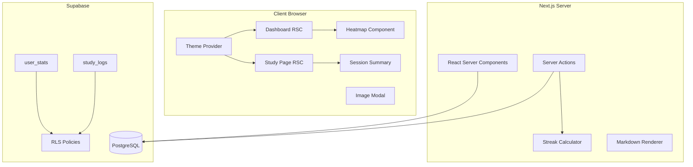

# Design Document

## Overview

Celline's OBGYN Prep V1 extends the existing MVP with gamification features (streaks, heatmap, session summary), UI/UX polish (dark/light mode, markdown support, image zoom), and a skeleton UI for bulk import. The design maintains the server-first architecture while adding client-side interactivity where necessary.

## Architecture



### New Components Integration

1. **Streak System:** Integrated into `rateCardAction` Server Action
2. **Heatmap:** Client component fetching data via RSC props
3. **Theme:** `next-themes` provider wrapping the app
4. **Markdown:** `react-markdown` with sanitization in Flashcard component
5. **Image Modal:** Client component with portal rendering

## Components and Interfaces

### Streak Calculator

```typescript
// lib/streak.ts
export interface StreakInput {
  lastStudyDate: Date | null;
  currentStreak: number;
  todayDate: Date;
}

export interface StreakOutput {
  newStreak: number;
  lastStudyDate: Date;
  isNewDay: boolean;
}

export function calculateStreak(input: StreakInput): StreakOutput;
```

### Heatmap Component

```typescript
// components/dashboard/StudyHeatmap.tsx
interface StudyHeatmapProps {
  studyLogs: Array<{
    study_date: string;
    cards_reviewed: number;
  }>;
}

export function StudyHeatmap({ studyLogs }: StudyHeatmapProps): JSX.Element;

// Helper function for color intensity
export function getHeatmapIntensity(count: number): 0 | 1 | 2 | 3;
```

### Session Summary Component

```typescript
// components/study/SessionSummary.tsx
interface SessionSummaryProps {
  totalReviewed: number;
  ratingBreakdown: {
    again: number;
    hard: number;
    good: number;
    easy: number;
  };
  dailyGoal: number | null;
  todayTotal: number;
  currentStreak: number;
  isNewStreak: boolean;
}

export function SessionSummary(props: SessionSummaryProps): JSX.Element;
```

### Theme Toggle Component

```typescript
// components/ui/ThemeToggle.tsx
export function ThemeToggle(): JSX.Element;
```

### Markdown Card Content

```typescript
// components/study/MarkdownContent.tsx
interface MarkdownContentProps {
  content: string;
}

export function MarkdownContent({ content }: MarkdownContentProps): JSX.Element;
```

### Image Modal Component

```typescript
// components/ui/ImageModal.tsx
interface ImageModalProps {
  src: string;
  alt: string;
  isOpen: boolean;
  onClose: () => void;
}

export function ImageModal(props: ImageModalProps): JSX.Element;
```

### Updated Server Actions

```typescript
// actions/study-actions.ts (extended)
export async function rateCardAction(
  cardId: string,
  rating: 1 | 2 | 3 | 4
): Promise<NextCardResult>;
// Now also updates user_stats and study_logs

// actions/stats-actions.ts (new)
export async function getUserStats(): Promise<UserStats>;
export async function getStudyLogs(days: number): Promise<StudyLog[]>;
export async function updateDailyGoal(goal: number): Promise<ActionResult>;
```

## Data Models

### New Database Tables

```sql
-- user_stats table
CREATE TABLE user_stats (
  user_id UUID PRIMARY KEY REFERENCES auth.users(id) ON DELETE CASCADE,
  last_study_date DATE,
  current_streak INTEGER DEFAULT 0,
  longest_streak INTEGER DEFAULT 0,
  total_reviews INTEGER DEFAULT 0,
  daily_goal INTEGER DEFAULT 20,
  created_at TIMESTAMPTZ DEFAULT NOW(),
  updated_at TIMESTAMPTZ DEFAULT NOW()
);

-- RLS for user_stats
ALTER TABLE user_stats ENABLE ROW LEVEL SECURITY;

CREATE POLICY "Users can view own stats" ON user_stats
  FOR SELECT USING (auth.uid() = user_id);

CREATE POLICY "Users can update own stats" ON user_stats
  FOR UPDATE USING (auth.uid() = user_id);

CREATE POLICY "Users can insert own stats" ON user_stats
  FOR INSERT WITH CHECK (auth.uid() = user_id);

-- study_logs table
CREATE TABLE study_logs (
  id UUID PRIMARY KEY DEFAULT gen_random_uuid(),
  user_id UUID NOT NULL REFERENCES auth.users(id) ON DELETE CASCADE,
  study_date DATE NOT NULL,
  cards_reviewed INTEGER DEFAULT 0,
  created_at TIMESTAMPTZ DEFAULT NOW(),
  updated_at TIMESTAMPTZ DEFAULT NOW(),
  UNIQUE(user_id, study_date)
);

-- RLS for study_logs
ALTER TABLE study_logs ENABLE ROW LEVEL SECURITY;

CREATE POLICY "Users can view own logs" ON study_logs
  FOR SELECT USING (auth.uid() = user_id);

CREATE POLICY "Users can insert own logs" ON study_logs
  FOR INSERT WITH CHECK (auth.uid() = user_id);

CREATE POLICY "Users can update own logs" ON study_logs
  FOR UPDATE USING (auth.uid() = user_id);

-- Indexes
CREATE INDEX idx_study_logs_user_date ON study_logs(user_id, study_date);
CREATE INDEX idx_user_stats_user_id ON user_stats(user_id);
```

### TypeScript Types

```typescript
// types/database.ts (extended)
export interface UserStats {
  user_id: string;
  last_study_date: string | null;
  current_streak: number;
  longest_streak: number;
  total_reviews: number;
  daily_goal: number;
  created_at: string;
  updated_at: string;
}

export interface StudyLog {
  id: string;
  user_id: string;
  study_date: string;
  cards_reviewed: number;
  created_at: string;
  updated_at: string;
}

// types/session.ts (new)
export interface SessionState {
  cardsReviewed: number;
  ratings: {
    again: number;
    hard: number;
    good: number;
    easy: number;
  };
}
```

## Correctness Properties

*A property is a characteristic or behavior that should hold true across all valid executions of a system-essentially, a formal statement about what the system should do. Properties serve as the bridge between human-readable specifications and machine-verifiable correctness guarantees.*

### Property 1: Streak Calculation Correctness

*For any* user stats state with a `last_study_date` and `current_streak`, and *for any* `today_date`:
- If `today_date` equals `last_study_date`, the streak SHALL remain unchanged
- If `today_date` is exactly one day after `last_study_date`, the streak SHALL increment by 1
- If `today_date` is more than one day after `last_study_date`, the streak SHALL reset to 1

**Validates: Requirements 1.2, 1.3, 1.4**

### Property 2: Longest Streak Invariant

*For any* user stats state, after any streak update operation, `longest_streak` SHALL be greater than or equal to `current_streak`.

**Validates: Requirements 1.5**

### Property 3: Total Reviews Increment

*For any* card rating action, the `total_reviews` count SHALL increase by exactly 1.

**Validates: Requirements 1.6**

### Property 4: Study Log Upsert Correctness

*For any* user and *for any* date, after N card ratings on that date, there SHALL be exactly one study_log record with `cards_reviewed` equal to N.

**Validates: Requirements 2.1, 9.1, 9.4**

### Property 5: Heatmap Color Intensity Mapping

*For any* `cards_reviewed` count:
- 0 cards SHALL map to intensity 0 (empty)
- 1-5 cards SHALL map to intensity 1 (light)
- 6-15 cards SHALL map to intensity 2 (medium)
- 16+ cards SHALL map to intensity 3 (dark)

**Validates: Requirements 2.3**

### Property 6: Session Tracking Accuracy

*For any* study session with a sequence of ratings, the session summary SHALL report:
- `totalReviewed` equal to the count of ratings given
- `ratingBreakdown` counts matching the actual ratings (again=1, hard=2, good=3, easy=4)

**Validates: Requirements 3.1, 3.2**

### Property 7: Theme State Persistence

*For any* theme toggle action, the new theme value SHALL be persisted to localStorage and the UI SHALL reflect the new theme.

**Validates: Requirements 4.2, 4.3**

### Property 8: Markdown Rendering Correctness

*For any* valid markdown input containing bold (`**text**`), italic (`*text*`), or code blocks, the rendered output SHALL contain the corresponding HTML elements (`<strong>`, `<em>`, `<code>`).

**Validates: Requirements 5.1**

### Property 9: Markdown XSS Sanitization

*For any* input containing `<script>` tags, `javascript:` URLs, or `on*` event handlers, the sanitized output SHALL NOT contain executable code.

**Validates: Requirements 5.4**

### Property 10: Markdown Round-Trip Consistency

*For any* markdown string, parsing and re-serializing (where applicable) SHALL produce consistent output.

**Validates: Requirements 5.5**

### Property 11: Deck Ownership Authorization

*For any* user attempting to access `/decks/[deckId]/add-bulk`, the page SHALL only render if the user owns the deck; otherwise, redirect to dashboard.

**Validates: Requirements 7.1**

### Property 12: User Stats RLS Enforcement

*For any* query against the `user_stats` table, the result SHALL contain only records where `user_id` matches the authenticated user's ID.

**Validates: Requirements 8.2**

### Property 13: Study Logs RLS Enforcement

*For any* query against the `study_logs` table, the result SHALL contain only records where `user_id` matches the authenticated user's ID.

**Validates: Requirements 9.2**

## Error Handling

### Streak System Errors

| Error Type | Handling Strategy |
|------------|-------------------|
| Missing user_stats record | Auto-create with defaults on first rating |
| Date parsing error | Use server date as fallback |
| Concurrent update | Use database transaction with row locking |

### Theme System Errors

| Error Type | Handling Strategy |
|------------|-------------------|
| localStorage unavailable | Fall back to system preference |
| Invalid stored value | Reset to system preference |

### Markdown Rendering Errors

| Error Type | Handling Strategy |
|------------|-------------------|
| Invalid markdown | Render as plain text |
| Sanitization failure | Strip all HTML, render plain text |

### Image Modal Errors

| Error Type | Handling Strategy |
|------------|-------------------|
| Image load failure | Show placeholder with error message |
| Invalid URL | Don't render modal trigger |

## Testing Strategy

### Testing Framework

- **Unit Testing:** Vitest for fast, TypeScript-native testing
- **Property-Based Testing:** fast-check library for generating random test inputs
- **Component Testing:** @testing-library/react for React components

### Unit Tests

Unit tests will cover:
- Streak calculation edge cases (null last_study_date, same day, consecutive day, gap)
- Heatmap intensity thresholds
- Markdown sanitization with specific XSS vectors
- Theme toggle state management

### Property-Based Tests

Property-based tests will use fast-check to verify correctness properties. Each property test will:
- Run a minimum of 100 iterations
- Use smart generators constrained to valid input spaces
- Be tagged with the corresponding correctness property reference

**Test File Structure:**
```
__tests__/
  streak.property.test.ts       # Properties 1-3
  study-log.property.test.ts    # Property 4
  heatmap.property.test.ts      # Property 5
  session.property.test.ts      # Property 6
  markdown.property.test.ts     # Properties 8-10
```

**Generator Examples:**

```typescript
// Streak input generator
const streakInputArb = fc.record({
  lastStudyDate: fc.option(fc.date({ min: new Date('2024-01-01'), max: new Date('2025-12-31') })),
  currentStreak: fc.integer({ min: 0, max: 1000 }),
  todayDate: fc.date({ min: new Date('2024-01-01'), max: new Date('2025-12-31') }),
});

// Study log sequence generator
const ratingSequenceArb = fc.array(
  fc.constantFrom(1, 2, 3, 4) as fc.Arbitrary<1 | 2 | 3 | 4>,
  { minLength: 1, maxLength: 50 }
);

// Markdown input generator
const markdownArb = fc.oneof(
  fc.string().map(s => `**${s}**`),  // bold
  fc.string().map(s => `*${s}*`),    // italic
  fc.string().map(s => `\`${s}\``),  // code
  fc.string(),                        // plain
);

// XSS payload generator
const xssPayloadArb = fc.oneof(
  fc.constant('<script>alert("xss")</script>'),
  fc.constant(''),
  fc.constant('<a href="javascript:alert(1)">click</a>'),
  fc.string().map(s => `<div onclick="alert('${s}')">`),
);
```

**Property Test Annotation Format:**
```typescript
// **Feature: cellines-obgyn-prep-v1, Property 1: Streak Calculation Correctness**
test.prop([streakInputArb])('streak calculation follows rules', (input) => {
  // test implementation
});
```

### Test Coverage Goals

| Component | Unit Tests | Property Tests |
|-----------|------------|----------------|
| Streak Calculator | Edge cases | Properties 1-3 |
| Study Log System | Upsert behavior | Property 4 |
| Heatmap | Threshold values | Property 5 |
| Session Tracking | State management | Property 6 |
| Markdown Renderer | XSS vectors | Properties 8-10 |
| Authorization | Access control | Property 11 |
