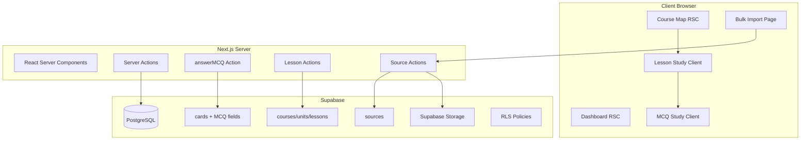

# Design Document

## Overview

Celline's OBGYN Prep V2 extends the existing SRS application with MCQ support, a Duolingo-style course structure, and enhanced bulk import. The design maintains the server-first architecture (RSC + Server Actions) while adding new data models and UI components for structured learning paths.

## Architecture



### Key Design Decisions

1. **Option A: Extend cards table** - MCQs are stored in the existing `cards` table with a `card_type` enum and additional MCQ-specific fields. This reuses the SRS infrastructure (interval, ease_factor, next_review).

2. **MCQ-to-SRS Mapping** - Correct answers map to rating 3 (Good), incorrect to rating 1 (Again). This provides simple but effective spaced repetition for MCQs.

3. **Lesson-based Study** - Lessons contain ordered references to MCQs/cards via `lesson_items`. This allows mixing content types in a single session.

4. **Progressive Unlocking** - Lessons unlock sequentially based on completion of the previous lesson, creating a Duolingo-style progression.

## Components and Interfaces

### MCQ Data Types

```typescript
// types/database.ts (extended)
export type CardType = 'flashcard' | 'mcq';

export interface Card {
  id: string;
  deck_id: string;
  card_type: CardType;
  // Flashcard fields
  front: string;
  back: string;
  // MCQ fields (nullable for flashcards)
  stem: string | null;
  options: string[] | null;
  correct_index: number | null;
  explanation: string | null;
  // Shared fields
  image_url: string | null;
  interval: number;
  ease_factor: number;
  next_review: string;
  created_at: string;
}

export interface MCQCard extends Card {
  card_type: 'mcq';
  stem: string;
  options: string[];
  correct_index: number;
  explanation: string | null;
}
```

### Course Hierarchy Types

```typescript
// types/database.ts (extended)
export interface Course {
  id: string;
  user_id: string;
  title: string;
  description: string | null;
  created_at: string;
}

export interface Unit {
  id: string;
  course_id: string;
  title: string;
  order_index: number;
  created_at: string;
}

export interface Lesson {
  id: string;
  unit_id: string;
  title: string;
  order_index: number;
  target_item_count: number;
  created_at: string;
}

export type LessonItemType = 'mcq' | 'card';

export interface LessonItem {
  id: string;
  lesson_id: string;
  item_type: LessonItemType;
  item_id: string;
  order_index: number;
}

export interface LessonProgress {
  id: string;
  user_id: string;
  lesson_id: string;
  last_completed_at: string;
  best_score: number;
  created_at: string;
}

export type LessonStatus = 'locked' | 'unlocked' | 'completed';
```

### Source Types

```typescript
// types/database.ts (extended)
export interface Source {
  id: string;
  user_id: string;
  title: string;
  type: string;
  file_url: string;
  metadata: Record<string, unknown> | null;
  created_at: string;
}

export interface DeckSource {
  id: string;
  deck_id: string;
  source_id: string;
  created_at: string;
}
```

### MCQ Study Component

```typescript
// components/study/MCQQuestion.tsx
interface MCQQuestionProps {
  card: MCQCard;
  onAnswer: (selectedIndex: number) => void;
  isAnswered: boolean;
  selectedIndex: number | null;
}

export function MCQQuestion(props: MCQQuestionProps): JSX.Element;
```

### MCQ Server Action

```typescript
// actions/mcq-actions.ts
export async function answerMCQAction(
  cardId: string,
  selectedIndex: number
): Promise<{
  success: boolean;
  isCorrect?: boolean;
  correctIndex?: number;
  explanation?: string | null;
  error?: string;
}>;
```

### Lesson Study Components

```typescript
// components/study/LessonStudy.tsx
interface LessonStudyProps {
  lesson: Lesson;
  items: Array<{ item: LessonItem; card: Card }>;
}

export function LessonStudy(props: LessonStudyProps): JSX.Element;

// components/study/LessonSummary.tsx
interface LessonSummaryProps {
  lessonId: string;
  totalItems: number;
  correctCount: number;
  mistakes: Array<{ card: Card; selectedIndex: number }>;
}

export function LessonSummary(props: LessonSummaryProps): JSX.Element;
```

### Course Map Component

```typescript
// components/course/CourseMap.tsx
interface CourseMapProps {
  course: Course;
  units: Array<{
    unit: Unit;
    lessons: Array<{
      lesson: Lesson;
      status: LessonStatus;
      bestScore: number | null;
    }>;
  }>;
}

export function CourseMap(props: CourseMapProps): JSX.Element;
```

### Lesson Status Helper

```typescript
// lib/lesson-status.ts
export interface LessonStatusInput {
  lessonOrderIndex: number;
  unitOrderIndex: number;
  progressMap: Map<string, LessonProgress>;
  previousLessonId: string | null;
}

export function calculateLessonStatus(input: LessonStatusInput): LessonStatus;
```

### MCQ Validation

```typescript
// lib/validations.ts (extended)
export const createMCQSchema = z.object({
  deckId: z.string().uuid(),
  stem: z.string().min(1, 'Question stem is required'),
  options: z.array(z.string().min(1)).min(2, 'At least 2 options required'),
  correctIndex: z.number().int().min(0),
  explanation: z.string().optional(),
  imageUrl: z.string().url().optional().or(z.literal('')),
}).refine(
  (data) => data.correctIndex < data.options.length,
  { message: 'Correct index must be within options bounds' }
);
```

## Data Models

### Schema Changes

```sql
-- Add card_type enum and MCQ fields to cards table
ALTER TABLE cards ADD COLUMN card_type TEXT DEFAULT 'flashcard' CHECK (card_type IN ('flashcard', 'mcq'));
ALTER TABLE cards ADD COLUMN stem TEXT;
ALTER TABLE cards ADD COLUMN options JSONB;
ALTER TABLE cards ADD COLUMN correct_index INTEGER;
ALTER TABLE cards ADD COLUMN explanation TEXT;

-- Courses table
CREATE TABLE courses (
  id UUID PRIMARY KEY DEFAULT gen_random_uuid(),
  user_id UUID NOT NULL REFERENCES auth.users(id) ON DELETE CASCADE,
  title TEXT NOT NULL,
  description TEXT,
  created_at TIMESTAMPTZ DEFAULT NOW()
);

ALTER TABLE courses ENABLE ROW LEVEL SECURITY;

CREATE POLICY "Users can manage own courses" ON courses
  FOR ALL USING (auth.uid() = user_id);

-- Units table
CREATE TABLE units (
  id UUID PRIMARY KEY DEFAULT gen_random_uuid(),
  course_id UUID NOT NULL REFERENCES courses(id) ON DELETE CASCADE,
  title TEXT NOT NULL,
  order_index INTEGER NOT NULL DEFAULT 0,
  created_at TIMESTAMPTZ DEFAULT NOW()
);

ALTER TABLE units ENABLE ROW LEVEL SECURITY;

CREATE POLICY "Users can manage units in own courses" ON units
  FOR ALL USING (
    EXISTS (SELECT 1 FROM courses WHERE courses.id = units.course_id AND courses.user_id = auth.uid())
  );

-- Lessons table
CREATE TABLE lessons (
  id UUID PRIMARY KEY DEFAULT gen_random_uuid(),
  unit_id UUID NOT NULL REFERENCES units(id) ON DELETE CASCADE,
  title TEXT NOT NULL,
  order_index INTEGER NOT NULL DEFAULT 0,
  target_item_count INTEGER DEFAULT 10,
  created_at TIMESTAMPTZ DEFAULT NOW()
);

ALTER TABLE lessons ENABLE ROW LEVEL SECURITY;

CREATE POLICY "Users can manage lessons in own courses" ON lessons
  FOR ALL USING (
    EXISTS (
      SELECT 1 FROM units 
      JOIN courses ON courses.id = units.course_id 
      WHERE units.id = lessons.unit_id AND courses.user_id = auth.uid()
    )
  );

-- Lesson items table
CREATE TABLE lesson_items (
  id UUID PRIMARY KEY DEFAULT gen_random_uuid(),
  lesson_id UUID NOT NULL REFERENCES lessons(id) ON DELETE CASCADE,
  item_type TEXT NOT NULL CHECK (item_type IN ('mcq', 'card')),
  item_id UUID NOT NULL,
  order_index INTEGER NOT NULL DEFAULT 0,
  created_at TIMESTAMPTZ DEFAULT NOW()
);

ALTER TABLE lesson_items ENABLE ROW LEVEL SECURITY;

CREATE POLICY "Users can manage lesson_items in own courses" ON lesson_items
  FOR ALL USING (
    EXISTS (
      SELECT 1 FROM lessons
      JOIN units ON units.id = lessons.unit_id
      JOIN courses ON courses.id = units.course_id
      WHERE lessons.id = lesson_items.lesson_id AND courses.user_id = auth.uid()
    )
  );

-- Lesson progress table
CREATE TABLE lesson_progress (
  id UUID PRIMARY KEY DEFAULT gen_random_uuid(),
  user_id UUID NOT NULL REFERENCES auth.users(id) ON DELETE CASCADE,
  lesson_id UUID NOT NULL REFERENCES lessons(id) ON DELETE CASCADE,
  last_completed_at TIMESTAMPTZ NOT NULL DEFAULT NOW(),
  best_score INTEGER NOT NULL DEFAULT 0,
  created_at TIMESTAMPTZ DEFAULT NOW(),
  UNIQUE(user_id, lesson_id)
);

ALTER TABLE lesson_progress ENABLE ROW LEVEL SECURITY;

CREATE POLICY "Users can manage own lesson_progress" ON lesson_progress
  FOR ALL USING (auth.uid() = user_id);

-- Sources table
CREATE TABLE sources (
  id UUID PRIMARY KEY DEFAULT gen_random_uuid(),
  user_id UUID NOT NULL REFERENCES auth.users(id) ON DELETE CASCADE,
  title TEXT NOT NULL,
  type TEXT NOT NULL DEFAULT 'pdf_book',
  file_url TEXT NOT NULL,
  metadata JSONB,
  created_at TIMESTAMPTZ DEFAULT NOW()
);

ALTER TABLE sources ENABLE ROW LEVEL SECURITY;

CREATE POLICY "Users can manage own sources" ON sources
  FOR ALL USING (auth.uid() = user_id);

-- Deck sources join table
CREATE TABLE deck_sources (
  id UUID PRIMARY KEY DEFAULT gen_random_uuid(),
  deck_id UUID NOT NULL REFERENCES decks(id) ON DELETE CASCADE,
  source_id UUID NOT NULL REFERENCES sources(id) ON DELETE CASCADE,
  created_at TIMESTAMPTZ DEFAULT NOW(),
  UNIQUE(deck_id, source_id)
);

ALTER TABLE deck_sources ENABLE ROW LEVEL SECURITY;

CREATE POLICY "Users can manage deck_sources for own decks" ON deck_sources
  FOR ALL USING (
    EXISTS (SELECT 1 FROM decks WHERE decks.id = deck_sources.deck_id AND decks.user_id = auth.uid())
  );

-- Indexes
CREATE INDEX idx_courses_user_id ON courses(user_id);
CREATE INDEX idx_units_course_id ON units(course_id);
CREATE INDEX idx_lessons_unit_id ON lessons(unit_id);
CREATE INDEX idx_lesson_items_lesson_id ON lesson_items(lesson_id);
CREATE INDEX idx_lesson_progress_user_lesson ON lesson_progress(user_id, lesson_id);
CREATE INDEX idx_sources_user_id ON sources(user_id);
CREATE INDEX idx_deck_sources_deck_id ON deck_sources(deck_id);
```

## Correctness Properties

*A property is a characteristic or behavior that should hold true across all valid executions of a system-essentially, a formal statement about what the system should do. Properties serve as the bridge between human-readable specifications and machine-verifiable correctness guarantees.*

### Property 1: MCQ Options Round-Trip Consistency

*For any* valid options array (array of non-empty strings with length >= 2), serializing to JSONB and deserializing back SHALL produce an identical array.

**Validates: Requirements 1.2**

### Property 2: MCQ Validation Correctness

*For any* MCQ input data:
- If stem is empty, validation SHALL reject
- If options has fewer than 2 elements, validation SHALL reject
- If correct_index is negative or >= options.length, validation SHALL reject
- If all constraints are satisfied, validation SHALL accept

**Validates: Requirements 1.4, 3.2**

### Property 3: MCQ Deck Authorization

*For any* user and *for any* deck, the user SHALL only be able to create, read, update, or delete MCQs in decks they own.

**Validates: Requirements 1.3, 3.4**

### Property 4: MCQ Answer Correctness Mapping

*For any* MCQ with correct_index C and *for any* selected_index S:
- If S equals C, the answer is correct and SHALL map to SRS rating 3 (Good)
- If S does not equal C, the answer is incorrect and SHALL map to SRS rating 1 (Again)

**Validates: Requirements 2.4, 2.5**

### Property 5: MCQ Stats Integration

*For any* MCQ answer action, the user_stats.total_reviews SHALL increment by 1 and study_logs.cards_reviewed for today SHALL increment by 1, identical to flashcard behavior.

**Validates: Requirements 2.6, 5.6**

### Property 6: Course Hierarchy RLS

*For any* user:
- The user SHALL only see courses where user_id matches their auth.uid()
- The user SHALL only see units in courses they own
- The user SHALL only see lessons in units of courses they own
- The user SHALL only see lesson_items in lessons of courses they own

**Validates: Requirements 4.1, 4.2, 4.3**

### Property 7: Course Hierarchy Cascade Delete

*For any* course deletion:
- All units belonging to that course SHALL be deleted
- All lessons belonging to those units SHALL be deleted
- All lesson_items belonging to those lessons SHALL be deleted

*For any* unit deletion:
- All lessons belonging to that unit SHALL be deleted
- All lesson_items belonging to those lessons SHALL be deleted

**Validates: Requirements 4.5, 4.6**

### Property 8: Lesson Items Ordering

*For any* lesson with N lesson_items, fetching items for that lesson SHALL return them sorted by order_index in ascending order.

**Validates: Requirements 5.1**

### Property 9: Lesson Item Type Routing

*For any* lesson_item:
- If item_type is 'mcq', the item SHALL be handled by the MCQ study flow
- If item_type is 'card', the item SHALL be handled by the flashcard study flow

**Validates: Requirements 5.2, 5.3**

### Property 10: Lesson Progress Persistence

*For any* lesson completion with score S:
- A lesson_progress record SHALL exist with user_id, lesson_id, and last_completed_at set to the completion time
- If no previous progress exists, best_score SHALL be set to S
- If previous progress exists with best_score B, the new best_score SHALL be max(B, S)

**Validates: Requirements 5.4, 7.1, 7.4**

### Property 11: Lesson Lock Status Logic

*For any* lesson L in a course:
- If L is the first lesson of the first unit (order_index 0 in unit with order_index 0), status SHALL be 'unlocked' or 'completed'
- If L has a previous lesson P (by order_index within unit, or last lesson of previous unit):
  - If P has no lesson_progress record, L status SHALL be 'locked'
  - If P has a lesson_progress record, L status SHALL be 'unlocked' or 'completed'
- If L has a lesson_progress record, status SHALL be 'completed'

**Validates: Requirements 6.2, 6.3, 6.4, 6.5, 7.3**

### Property 12: Lesson Progress RLS

*For any* user, queries against lesson_progress SHALL only return records where user_id matches auth.uid().

**Validates: Requirements 7.2**

### Property 13: Source Access Control

*For any* user:
- The user SHALL only see sources where user_id matches their auth.uid()
- The user SHALL NOT be able to access another user's PDF file via direct URL

**Validates: Requirements 8.2, 9.5**

### Property 14: PDF Upload Validation

*For any* file upload:
- If the file is not a PDF (by MIME type or extension), the upload SHALL be rejected
- If the file exceeds the maximum size limit, the upload SHALL be rejected

**Validates: Requirements 8.4**

### Property 15: Source-Deck Linking

*For any* source linked to a deck:
- A deck_sources record SHALL exist with the correct deck_id and source_id
- The source SHALL be retrievable when querying sources for that deck

**Validates: Requirements 8.3, 9.3**

## Error Handling

### MCQ Errors

| Error Type | Handling Strategy |
|------------|-------------------|
| Invalid MCQ data | Return validation errors with field-specific messages |
| Deck not owned | Return "Deck not found or access denied" |
| Invalid selected_index | Return "Invalid answer selection" |

### Course/Lesson Errors

| Error Type | Handling Strategy |
|------------|-------------------|
| Course not found | Return 404 or redirect to dashboard |
| Lesson locked | Display lock message, prevent study start |
| Lesson item missing | Skip item, log warning, continue session |

### Source/Upload Errors

| Error Type | Handling Strategy |
|------------|-------------------|
| Invalid file type | Return "Only PDF files are allowed" |
| File too large | Return "File exceeds maximum size of X MB" |
| Storage upload failed | Return "Upload failed, please try again" |
| Source not found | Return "Source not found or access denied" |

## Testing Strategy

### Testing Framework

- **Unit Testing:** Vitest for fast, TypeScript-native testing
- **Property-Based Testing:** fast-check library for generating random test inputs
- **Component Testing:** @testing-library/react for React components

### Unit Tests

Unit tests will cover:
- MCQ validation edge cases (empty stem, single option, boundary indices)
- Lesson status calculation with various progress states
- Score calculation for lesson completion

### Property-Based Tests

Property-based tests will use fast-check to verify correctness properties. Each property test will:
- Run a minimum of 100 iterations
- Use smart generators constrained to valid input spaces
- Be tagged with the corresponding correctness property reference

**Test File Structure:**
```
__tests__/
  mcq-validation.property.test.ts    # Property 2
  mcq-answer.property.test.ts        # Property 4
  mcq-options.property.test.ts       # Property 1
  lesson-status.property.test.ts     # Property 11
  lesson-progress.property.test.ts   # Property 10
  lesson-items.property.test.ts      # Properties 8, 9
```

**Generator Examples:**

```typescript
// MCQ options generator
const mcqOptionsArb = fc.array(
  fc.string({ minLength: 1, maxLength: 200 }),
  { minLength: 2, maxLength: 6 }
);

// MCQ input generator
const mcqInputArb = fc.record({
  stem: fc.string({ minLength: 1, maxLength: 1000 }),
  options: mcqOptionsArb,
  correctIndex: fc.nat(),
  explanation: fc.option(fc.string({ maxLength: 2000 })),
});

// Lesson progress map generator
const lessonProgressMapArb = fc.dictionary(
  fc.uuid(),
  fc.record({
    lastCompletedAt: fc.date(),
    bestScore: fc.integer({ min: 0, max: 100 }),
  })
);

// Lesson order generator for status testing
const lessonOrderArb = fc.record({
  lessonOrderIndex: fc.nat({ max: 20 }),
  unitOrderIndex: fc.nat({ max: 10 }),
  hasPreviousProgress: fc.boolean(),
  hasOwnProgress: fc.boolean(),
});
```

**Property Test Annotation Format:**
```typescript
// **Feature: cellines-obgyn-prep-v2, Property 1: MCQ Options Round-Trip Consistency**
test.prop([mcqOptionsArb])('options round-trip preserves data', (options) => {
  const serialized = JSON.stringify(options);
  const deserialized = JSON.parse(serialized);
  expect(deserialized).toEqual(options);
});
```

### Test Coverage Goals

| Component | Unit Tests | Property Tests |
|-----------|------------|----------------|
| MCQ Validation | Edge cases | Property 2 |
| MCQ Options | Serialization | Property 1 |
| MCQ Answer Logic | Correctness mapping | Property 4 |
| Lesson Status | State combinations | Property 11 |
| Lesson Progress | Score updates | Property 10 |
| Lesson Items | Ordering, routing | Properties 8, 9 |

