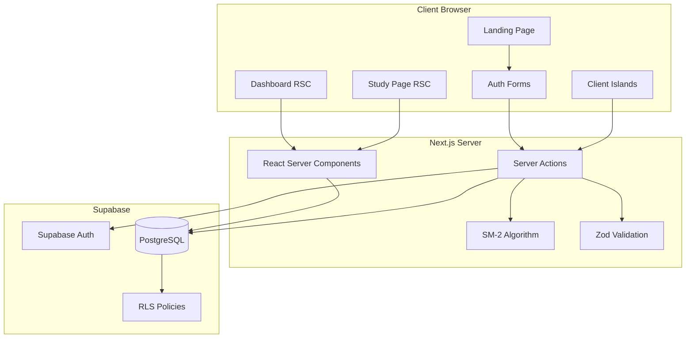

# Design Document

## Overview

Celline's OBGYN Prep is a server-first Spaced Repetition System (SRS) built with Next.js 14+ App Router, Supabase, and TypeScript. The application follows a strict server-first architecture using React Server Components for data fetching and Server Actions for mutations, eliminating the need for traditional API routes.

The system implements the SM-2 algorithm to intelligently schedule flashcard reviews, optimizing learning efficiency through spaced repetition. All user data is protected by PostgreSQL Row Level Security (RLS) policies.

## Architecture



### Architecture Principles

1. **Server-First Rendering:** All data fetching occurs in React Server Components, minimizing client-side JavaScript.
2. **Client Islands:** Interactive elements (forms, rating buttons) use `"use client"` directive sparingly.
3. **No API Routes:** All mutations use Server Actions for type-safe, secure server-side operations.
4. **Security by Default:** RLS policies enforce data isolation at the database level.

## Components and Interfaces

### Page Components (Server)

```typescript
// app/(auth)/login/page.tsx - Server Component
export default async function LoginPage() {
  // Renders login/register forms
}

// app/(app)/dashboard/page.tsx - Server Component
export default async function DashboardPage() {
  // Fetches user decks with due counts
  // Renders deck list
}

// app/(app)/study/[deckId]/page.tsx - Server Component
export default async function StudyPage({ params }: { params: { deckId: string } }) {
  // Fetches due cards for deck
  // Renders study interface
}
```

### Client Components (Islands)

```typescript
// components/ui/Button.tsx
interface ButtonProps {
  variant?: 'primary' | 'secondary' | 'ghost';
  size?: 'sm' | 'md' | 'lg';
  children: React.ReactNode;
  onClick?: () => void;
  disabled?: boolean;
  type?: 'button' | 'submit';
}

// components/ui/Input.tsx
interface InputProps {
  label: string;
  name: string;
  type?: 'text' | 'email' | 'password' | 'url';
  error?: string;
  placeholder?: string;
}

// components/study/Flashcard.tsx
interface FlashcardProps {
  front: string;
  back: string;
  imageUrl?: string | null;
  isRevealed: boolean;
  onReveal: () => void;
}

// components/study/RatingButtons.tsx
interface RatingButtonsProps {
  cardId: string;
  onRate: (rating: 1 | 2 | 3 | 4) => Promise<void>;
}
```

### Server Actions

```typescript
// actions/auth-actions.ts
export async function loginAction(formData: FormData): Promise<ActionResult>;
export async function registerAction(formData: FormData): Promise<ActionResult>;
export async function logoutAction(): Promise<void>;

// actions/deck-actions.ts
export async function createDeckAction(formData: FormData): Promise<ActionResult>;
export async function deleteDeckAction(deckId: string): Promise<ActionResult>;

// actions/card-actions.ts
export async function createCardAction(formData: FormData): Promise<ActionResult>;

// actions/study-actions.ts
export async function rateCardAction(cardId: string, rating: 1 | 2 | 3 | 4): Promise<NextCardResult>;
```

### Supabase Client Utilities

```typescript
// lib/supabase/server.ts
export function createServerClient(): SupabaseClient;
export async function getUser(): Promise<User | null>;

// lib/supabase/client.ts
export function createBrowserClient(): SupabaseClient;
```

## Data Models

### Database Schema

```sql
-- schema.sql

-- Enable UUID extension
CREATE EXTENSION IF NOT EXISTS "uuid-ossp";

-- Decks table
CREATE TABLE decks (
  id UUID PRIMARY KEY DEFAULT gen_random_uuid(),
  user_id UUID NOT NULL REFERENCES auth.users(id) ON DELETE CASCADE,
  title TEXT NOT NULL,
  created_at TIMESTAMPTZ DEFAULT NOW()
);

-- Cards table
CREATE TABLE cards (
  id UUID PRIMARY KEY DEFAULT gen_random_uuid(),
  deck_id UUID NOT NULL REFERENCES decks(id) ON DELETE CASCADE,
  front TEXT NOT NULL,
  back TEXT NOT NULL,
  image_url TEXT,
  interval INTEGER DEFAULT 0,
  ease_factor REAL DEFAULT 2.5,
  next_review TIMESTAMPTZ DEFAULT NOW(),
  created_at TIMESTAMPTZ DEFAULT NOW()
);

-- RLS Policies for decks
ALTER TABLE decks ENABLE ROW LEVEL SECURITY;

CREATE POLICY "Users can view own decks" ON decks
  FOR SELECT USING (auth.uid() = user_id);

CREATE POLICY "Users can insert own decks" ON decks
  FOR INSERT WITH CHECK (auth.uid() = user_id);

CREATE POLICY "Users can update own decks" ON decks
  FOR UPDATE USING (auth.uid() = user_id);

CREATE POLICY "Users can delete own decks" ON decks
  FOR DELETE USING (auth.uid() = user_id);

-- RLS Policies for cards (via deck ownership)
ALTER TABLE cards ENABLE ROW LEVEL SECURITY;

CREATE POLICY "Users can view cards in own decks" ON cards
  FOR SELECT USING (
    EXISTS (SELECT 1 FROM decks WHERE decks.id = cards.deck_id AND decks.user_id = auth.uid())
  );

CREATE POLICY "Users can insert cards in own decks" ON cards
  FOR INSERT WITH CHECK (
    EXISTS (SELECT 1 FROM decks WHERE decks.id = cards.deck_id AND decks.user_id = auth.uid())
  );

CREATE POLICY "Users can update cards in own decks" ON cards
  FOR UPDATE USING (
    EXISTS (SELECT 1 FROM decks WHERE decks.id = cards.deck_id AND decks.user_id = auth.uid())
  );

CREATE POLICY "Users can delete cards in own decks" ON cards
  FOR DELETE USING (
    EXISTS (SELECT 1 FROM decks WHERE decks.id = cards.deck_id AND decks.user_id = auth.uid())
  );

-- Indexes for performance
CREATE INDEX idx_decks_user_id ON decks(user_id);
CREATE INDEX idx_cards_deck_id ON cards(deck_id);
CREATE INDEX idx_cards_next_review ON cards(next_review);
```

### TypeScript Types

```typescript
// types/database.ts
export interface Deck {
  id: string;
  user_id: string;
  title: string;
  created_at: string;
}

export interface Card {
  id: string;
  deck_id: string;
  front: string;
  back: string;
  image_url: string | null;
  interval: number;
  ease_factor: number;
  next_review: string;
  created_at: string;
}

export interface DeckWithDueCount extends Deck {
  due_count: number;
}

// types/actions.ts
export type ActionResult = 
  | { success: true; data?: unknown }
  | { success: false; error: string; fieldErrors?: Record<string, string[]> };

export type NextCardResult =
  | { success: true; nextCard: Card | null; remainingCount: number }
  | { success: false; error: string };
```

### Zod Validation Schemas

```typescript
// lib/validations.ts
import { z } from 'zod';

export const loginSchema = z.object({
  email: z.string().email('Invalid email address'),
  password: z.string().min(6, 'Password must be at least 6 characters'),
});

export const registerSchema = z.object({
  email: z.string().email('Invalid email address'),
  password: z.string().min(6, 'Password must be at least 6 characters'),
  confirmPassword: z.string(),
}).refine((data) => data.password === data.confirmPassword, {
  message: 'Passwords do not match',
  path: ['confirmPassword'],
});

export const createDeckSchema = z.object({
  title: z.string().min(1, 'Title is required').max(100, 'Title too long'),
});

export const createCardSchema = z.object({
  deckId: z.string().uuid('Invalid deck ID'),
  front: z.string().min(1, 'Front content is required'),
  back: z.string().min(1, 'Back content is required'),
  imageUrl: z.string().url('Invalid URL').optional().or(z.literal('')),
});

export const ratingSchema = z.object({
  cardId: z.string().uuid('Invalid card ID'),
  rating: z.union([z.literal(1), z.literal(2), z.literal(3), z.literal(4)]),
});
```

### SM-2 Algorithm Implementation

```typescript
// lib/sm2.ts
export interface SM2Input {
  interval: number;
  easeFactor: number;
  rating: 1 | 2 | 3 | 4;
}

export interface SM2Output {
  interval: number;
  easeFactor: number;
  nextReview: Date;
}

export function calculateNextReview(input: SM2Input): SM2Output {
  const { interval, easeFactor, rating } = input;
  const now = new Date();
  
  let newInterval: number;
  let newEaseFactor: number;
  
  switch (rating) {
    case 1: // Again
      newInterval = 0;
      newEaseFactor = Math.max(1.3, easeFactor - 0.2);
      // Next review in 1 minute
      return {
        interval: newInterval,
        easeFactor: newEaseFactor,
        nextReview: new Date(now.getTime() + 60 * 1000),
      };
      
    case 2: // Hard
      newInterval = Math.max(1, Math.round(interval * 1.2));
      newEaseFactor = Math.max(1.3, easeFactor - 0.15);
      break;
      
    case 3: // Good
      newInterval = interval === 0 ? 1 : Math.round(interval * easeFactor);
      newEaseFactor = easeFactor;
      break;
      
    case 4: // Easy
      newInterval = interval === 0 ? 4 : Math.round(interval * (easeFactor + 0.15));
      newEaseFactor = easeFactor + 0.15;
      break;
  }
  
  // Calculate next review date (interval in days)
  const nextReview = new Date(now.getTime() + newInterval * 24 * 60 * 60 * 1000);
  
  return {
    interval: newInterval,
    easeFactor: newEaseFactor,
    nextReview,
  };
}

// Serialization for round-trip testing
export function serializeCardState(card: { interval: number; easeFactor: number; nextReview: Date }): string {
  return JSON.stringify({
    interval: card.interval,
    easeFactor: card.easeFactor,
    nextReview: card.nextReview.toISOString(),
  });
}

export function deserializeCardState(json: string): { interval: number; easeFactor: number; nextReview: Date } {
  const parsed = JSON.parse(json);
  return {
    interval: parsed.interval,
    easeFactor: parsed.easeFactor,
    nextReview: new Date(parsed.nextReview),
  };
}
```


## Correctness Properties

*A property is a characteristic or behavior that should hold true across all valid executions of a system-essentially, a formal statement about what the system should do. Properties serve as the bridge between human-readable specifications and machine-verifiable correctness guarantees.*

### Property 1: SM-2 "Again" Rating Resets Interval

*For any* card with any interval and ease factor, when rated as "Again" (1), the resulting interval SHALL be 0 and the next review SHALL be approximately 1 minute from the current time.

**Validates: Requirements 4.1**

### Property 2: SM-2 "Hard" Rating Multiplies Interval

*For any* card with interval > 0 and any valid ease factor, when rated as "Hard" (2), the resulting interval SHALL be approximately interval × 1.2 (rounded), and the ease factor SHALL decrease but remain >= 1.3.

**Validates: Requirements 4.2**

### Property 3: SM-2 "Good" Rating Uses Ease Factor

*For any* card with interval > 0 and any valid ease factor, when rated as "Good" (3), the resulting interval SHALL be approximately interval × ease_factor (rounded), and the ease factor SHALL remain unchanged.

**Validates: Requirements 4.3**

### Property 4: SM-2 "Easy" Rating Increases Interval and Ease

*For any* card with interval > 0 and any valid ease factor, when rated as "Easy" (4), the resulting interval SHALL be approximately interval × (ease_factor + 0.15) (rounded), and the ease factor SHALL increase by 0.15.

**Validates: Requirements 4.4**

### Property 5: Ease Factor Minimum Invariant

*For any* card and *for any* sequence of ratings applied to that card, the ease factor SHALL never fall below 1.3.

**Validates: Requirements 4.5**

### Property 6: Card State Serialization Round-Trip

*For any* valid card state (interval, ease factor, next review date), serializing to JSON and deserializing back SHALL produce an equivalent card state.

**Validates: Requirements 4.6**

### Property 7: Deck RLS Enforcement

*For any* user and *for any* query against the decks table, the result set SHALL contain only decks where user_id matches the authenticated user's ID.

**Validates: Requirements 2.2, 2.4, 8.1**

### Property 8: Card RLS Enforcement

*For any* user and *for any* query against the cards table, the result set SHALL contain only cards belonging to decks owned by the authenticated user.

**Validates: Requirements 3.3, 8.2**

### Property 9: Cascade Delete Integrity

*For any* deck deletion, after the operation completes, there SHALL be zero cards in the database with the deleted deck's ID.

**Validates: Requirements 2.3, 3.4**

### Property 10: Card Default Values on Creation

*For any* newly created card, the initial values SHALL be: interval = 0, ease_factor = 2.5, and next_review <= current timestamp.

**Validates: Requirements 3.1**

### Property 11: Due Card Filtering Correctness

*For any* deck and *for any* current timestamp, the set of due cards returned SHALL contain exactly those cards where next_review <= current timestamp.

**Validates: Requirements 5.1**

### Property 12: Due Count Calculation Correctness

*For any* deck displayed on the dashboard, the due_count SHALL equal the count of cards in that deck where next_review <= current timestamp.

**Validates: Requirements 6.2**

### Property 13: Zod Validation Rejects Invalid Inputs

*For any* input that violates the Zod schema constraints (invalid email format, password too short, empty required fields), the validation SHALL return a failure result with structured error messages.

**Validates: Requirements 1.3, 9.1, 9.2**

## Error Handling

### Client-Side Errors

| Error Type | Handling Strategy |
|------------|-------------------|
| Validation Error | Display field-specific error messages below inputs |
| Network Error | Show toast notification with retry option |
| Session Expired | Redirect to login page with message |

### Server-Side Errors

| Error Type | Handling Strategy |
|------------|-------------------|
| Zod Validation Failure | Return `{ success: false, fieldErrors: {...} }` |
| Database Error | Log error, return generic message to client |
| Auth Error | Return `{ success: false, error: 'Authentication required' }` |
| RLS Violation | Supabase returns empty result (silent fail-safe) |

### Error Response Structure

```typescript
// Consistent error response from Server Actions
type ActionResult = 
  | { success: true; data?: unknown }
  | { 
      success: false; 
      error: string; 
      fieldErrors?: Record<string, string[]>;
    };
```

## Testing Strategy

### Testing Framework

- **Unit Testing:** Vitest for fast, TypeScript-native testing
- **Property-Based Testing:** fast-check library for generating random test inputs
- **Integration Testing:** Playwright for E2E flows (optional for MVP)

### Unit Tests

Unit tests will cover:
- Zod schema validation with specific valid/invalid examples
- SM-2 algorithm edge cases (interval = 0, minimum ease factor)
- Component rendering with specific props
- Server Action response handling

### Property-Based Tests

Property-based tests will use fast-check to verify correctness properties. Each property test will:
- Run a minimum of 100 iterations
- Use smart generators constrained to valid input spaces
- Be tagged with the corresponding correctness property reference

**Test File Structure:**
```
__tests__/
  sm2.property.test.ts      # Properties 1-6
  validation.property.test.ts # Property 13
  database.property.test.ts  # Properties 7-12 (requires test DB)
```

**Generator Examples:**

```typescript
// SM-2 input generator
const sm2InputArb = fc.record({
  interval: fc.integer({ min: 0, max: 365 }),
  easeFactor: fc.float({ min: 1.3, max: 4.0 }),
  rating: fc.constantFrom(1, 2, 3, 4) as fc.Arbitrary<1 | 2 | 3 | 4>,
});

// Card state generator for serialization
const cardStateArb = fc.record({
  interval: fc.integer({ min: 0, max: 365 }),
  easeFactor: fc.float({ min: 1.3, max: 4.0 }),
  nextReview: fc.date({ min: new Date('2020-01-01'), max: new Date('2030-01-01') }),
});

// Invalid email generator
const invalidEmailArb = fc.oneof(
  fc.constant(''),
  fc.string().filter(s => !s.includes('@')),
  fc.string().map(s => s + '@'),
  fc.string().map(s => '@' + s),
);
```

**Property Test Annotation Format:**
```typescript
// **Feature: cellines-obgyn-prep, Property 1: SM-2 "Again" Rating Resets Interval**
test.prop([sm2InputArb])('Again rating resets interval to 0', (input) => {
  const result = calculateNextReview({ ...input, rating: 1 });
  expect(result.interval).toBe(0);
});
```

### Test Coverage Goals

| Component | Unit Tests | Property Tests |
|-----------|------------|----------------|
| SM-2 Algorithm | Edge cases | Properties 1-6 |
| Zod Schemas | Valid/invalid examples | Property 13 |
| Database Queries | N/A | Properties 7-12 |
| UI Components | Render tests | N/A |
