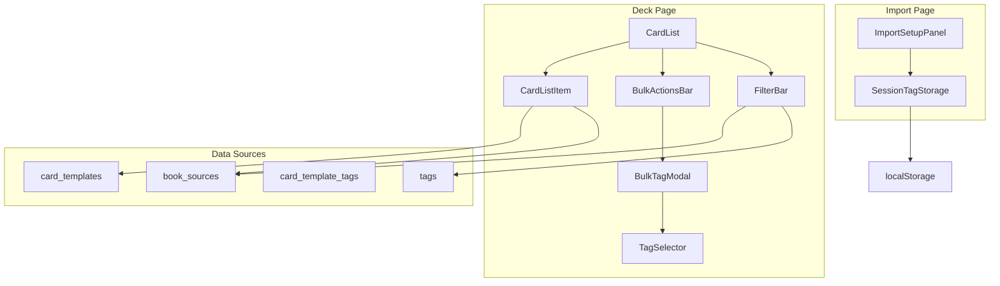

# Design Document: V11.1 - Tagging Ergonomics

## Overview

V11.1 improves tagging workflows with three key enhancements:

1. **Bulk Action Bar** - Floating toolbar for batch operations when cards are selected
2. **Creatable Select** - "Create tag" option pinned at top of TagSelector dropdown
3. **Virtual Source Badges** - Blue badges showing book title from `book_sources` (not real tags)
4. **Unified Filter Bar** - Source filter section alongside existing Topic filters
5. **Sticky Import Context** - localStorage persistence for Source/Chapter/Session Tags

All changes extend existing components without breaking current functionality.

## Architecture



## Components and Interfaces

### 1. Enhanced BulkActionsBar

The existing `BulkActionsBar` already supports bulk tagging. We'll ensure it's prominently displayed as a floating bar.

```typescript
// src/components/cards/BulkActionsBar.tsx (existing, verify floating behavior)
interface BulkActionsBarProps {
  selectedCount: number
  onDelete: () => void
  onMove: () => void
  onExport: () => void
  onAddTag: () => void
  onAutoTag: () => void
  isAutoTagging: boolean
  onClearSelection: () => void
}
```

**Behavior:**
- Renders as `fixed bottom-4` when `selectedCount > 0`
- "Add Tag" button opens BulkTagModal
- Handles 50+ cards via batched `bulkAddTagToCards`

### 2. Enhanced TagSelector with Create at Top

```typescript
// src/components/tags/TagSelector.tsx (enhanced)
interface TagSelectorProps {
  selectedTagIds: string[]
  onChange: (tagIds: string[]) => void
  maxSelections?: number
}

// New internal state
interface TagSelectorState {
  searchQuery: string
  showCreateOption: boolean  // true when query is non-empty and doesn't match existing tag
}
```

**New Behavior:**
- Search input filters tags in real-time
- "Create '<query>' tag" option appears at TOP when:
  - `searchQuery.trim().length > 0`
  - No existing tag matches `searchQuery` (case-insensitive)
- Enter key creates and selects the new tag
- Existing tags appear below, filtered by search

**UI Structure:**
```
┌─────────────────────────────┐
│ 🔍 Search tags...           │
├─────────────────────────────┤
│ ➕ Create "Anatomy" tag     │  ← Pinned at top
├─────────────────────────────┤
│ ○ Anatomical Pathology      │  ← Filtered existing tags
│ ○ Anatomy Review            │
│ ○ ...                       │
└─────────────────────────────┘
```

### 3. CardListItem with Virtual Source Badge

```typescript
// src/components/cards/CardListItem.tsx (enhanced)
interface CardListItemProps {
  card: CardWithTags & {
    book_source_id?: string | null
    book_source?: { id: string; title: string } | null  // Joined data
  }
  // ... existing props
}
```

**New Behavior:**
- If `card.book_source` exists, render a blue "Source" badge
- Badge shows book title (e.g., "📚 Lange")
- Badge is NOT a tag - purely visual, derived from `book_sources`
- Positioned before topic tags in the tag row

**Badge Component:**
```typescript
// src/components/cards/SourceBadge.tsx (new)
interface SourceBadgeProps {
  title: string
}

export function SourceBadge({ title }: SourceBadgeProps) {
  return (
    <span className="inline-flex items-center gap-1 px-2 py-0.5 text-xs font-medium rounded-full bg-blue-100 text-blue-800 dark:bg-blue-900/30 dark:text-blue-300">
      <BookOpen className="w-3 h-3" />
      {title}
    </span>
  )
}
```

### 4. Enhanced FilterBar with Source Section

```typescript
// src/components/tags/FilterBar.tsx (enhanced)
interface FilterBarProps {
  tags: Tag[]
  selectedTagIds: string[]
  onTagsChange: (tagIds: string[]) => void
  onClear: () => void
  showUntaggedOnly?: boolean
  onShowUntaggedOnlyChange?: (value: boolean) => void
  untaggedCount?: number
  // V11.1: Source filtering
  availableSources?: BookSource[]
  selectedSourceIds?: string[]
  onSourcesChange?: (sourceIds: string[]) => void
}
```

**New Behavior:**
- "By Source" section appears when `availableSources` is provided
- Source filter uses `book_source_id` column, NOT tags
- Combines with topic filter using AND logic
- Shows distinct sources from cards in current deck

### 5. Sticky Import Context Storage

```typescript
// src/lib/import-context-storage.ts (new)
interface ImportContext {
  bookSourceId: string | null
  chapterId: string | null
  sessionTagIds: string[]
}

const STORAGE_KEY_PREFIX = 'specialize:import-context:'

export function getImportContext(deckId: string): ImportContext {
  const key = `${STORAGE_KEY_PREFIX}${deckId}`
  const stored = localStorage.getItem(key)
  if (!stored) {
    return { bookSourceId: null, chapterId: null, sessionTagIds: [] }
  }
  return JSON.parse(stored)
}

export function setImportContext(deckId: string, context: ImportContext): void {
  const key = `${STORAGE_KEY_PREFIX}${deckId}`
  localStorage.setItem(key, JSON.stringify(context))
}

export function clearImportContext(deckId: string): void {
  const key = `${STORAGE_KEY_PREFIX}${deckId}`
  localStorage.removeItem(key)
}
```

### 6. Data Fetching for Source Badges

The deck detail page query needs to join `book_sources`:

```sql
-- Enhanced query for deck cards with source info
SELECT 
  ct.*,
  bs.id as book_source_id,
  bs.title as book_source_title
FROM card_templates ct
LEFT JOIN book_sources bs ON ct.book_source_id = bs.id
WHERE ct.deck_template_id = $1
ORDER BY ct.created_at DESC
```

## Data Models

### Card with Source (Extended Type)

```typescript
// src/types/database.ts (extended)
export interface CardTemplateWithSource extends CardTemplate {
  book_source?: {
    id: string
    title: string
  } | null
}
```

### Filter State

```typescript
// Used in CardList component
interface FilterState {
  tagIds: string[]           // Topic filter (existing)
  sourceIds: string[]        // Source filter (new)
  showUntaggedOnly: boolean  // Untagged filter (existing)
  showNeedsReviewOnly: boolean // NeedsReview filter (existing)
}
```

## Correctness Properties

*A property is a characteristic or behavior that should hold true across all valid executions of a system-essentially, a formal statement about what the system should do. Properties serve as the bridge between human-readable specifications and machine-verifiable correctness guarantees.*

### Property 1: Bulk Action Bar Visibility
*For any* non-empty set of selected card IDs, the Bulk Action Bar SHALL be visible (rendered).
**Validates: Requirements 1.1**

### Property 2: Bulk Tag Application Completeness
*For any* set of selected card IDs and a valid tag ID, calling `bulkAddTagToCards` SHALL result in all cards having that tag association.
**Validates: Requirements 1.4**

### Property 3: Create Option Position
*For any* non-empty search query that does not match an existing tag name (case-insensitive), the "Create" option SHALL appear as the first item in the dropdown list.
**Validates: Requirements 2.1, 2.3**

### Property 4: Create Option Suppression
*For any* search query that is empty OR matches an existing tag name exactly (case-insensitive), the "Create" option SHALL NOT appear.
**Validates: Requirements 2.5**

### Property 5: Source Badge Presence
*For any* card with a non-null `book_source_id`, the rendered CardListItem SHALL include a Source badge containing the book title.
**Validates: Requirements 3.2**

### Property 6: Source Badge Absence
*For any* card with a null `book_source_id`, the rendered CardListItem SHALL NOT include a Source badge.
**Validates: Requirements 3.5**

### Property 7: No Tag Creation for Source Badge
*For any* card display operation that renders a Source badge, the operation SHALL NOT create any new tag records in the database.
**Validates: Requirements 3.4**

### Property 8: Source Filter Distinct Sources
*For any* set of cards with `book_source_id` values, the Source filter section SHALL list exactly the distinct `book_sources` referenced by those cards.
**Validates: Requirements 4.2**

### Property 9: Source Filter Correctness
*For any* selected source ID, filtering cards SHALL return exactly the cards where `book_source_id` matches the selected source.
**Validates: Requirements 4.3**

### Property 10: Combined Filter AND Logic
*For any* combination of source filter and topic filter, the filtered cards SHALL be the intersection (AND) of cards matching the source AND cards matching the topic.
**Validates: Requirements 4.5, 4.6**

### Property 11: Import Context Persistence
*For any* import context (bookSourceId, chapterId, sessionTagIds) set on a BulkImportPage, the values SHALL be persisted to localStorage under a deck-scoped key.
**Validates: Requirements 5.1, 5.2, 5.3, 5.6**

### Property 12: Import Context Restoration
*For any* persisted import context, loading the BulkImportPage for the same deck SHALL restore those values to the UI state.
**Validates: Requirements 5.4**

### Property 13: Import Context Deck Scoping
*For any* two different deck IDs, their import contexts SHALL be stored under different localStorage keys and SHALL NOT interfere with each other.
**Validates: Requirements 5.5, 5.6**

## Error Handling

### Bulk Tagging Errors
- Network failure: Show toast "Failed to tag cards. Please try again."
- Partial failure: Show toast with count "Tagged X of Y cards"
- Tag not found: Show toast "Tag no longer exists"

### Source Badge Errors
- Book source fetch failure: Silently omit badge, log warning
- Missing book_sources row: Treat as null, no badge

### Import Context Errors
- localStorage unavailable: Fall back to in-memory state
- Corrupted JSON: Reset to default context

## Testing Strategy

### Unit Tests
- TagSelector renders Create option at top when appropriate
- TagSelector hides Create option when query matches existing tag
- SourceBadge renders with correct title
- FilterBar shows Source section when sources provided
- Import context storage functions work correctly

### Property-Based Tests (fast-check)

The following properties will be tested using fast-check:

1. **Bulk Action Bar visibility** - Generate selection sets, verify bar renders when non-empty
2. **Create option position** - Generate search queries and tag lists, verify ordering
3. **Create option suppression** - Generate matching queries, verify no Create option
4. **Source badge presence/absence** - Generate cards with/without book_source_id
5. **Source filter correctness** - Generate cards with various source IDs, verify filter
6. **Combined filter AND logic** - Generate source + topic filters, verify intersection
7. **Import context persistence** - Generate contexts, verify localStorage round-trip
8. **Import context deck scoping** - Generate multiple deck contexts, verify isolation

Each property test will run 100+ iterations with random inputs.

### Integration Tests
- Full bulk tag flow with 50+ cards
- Filter bar with combined source + topic filters
- Import page with sticky context across reloads

