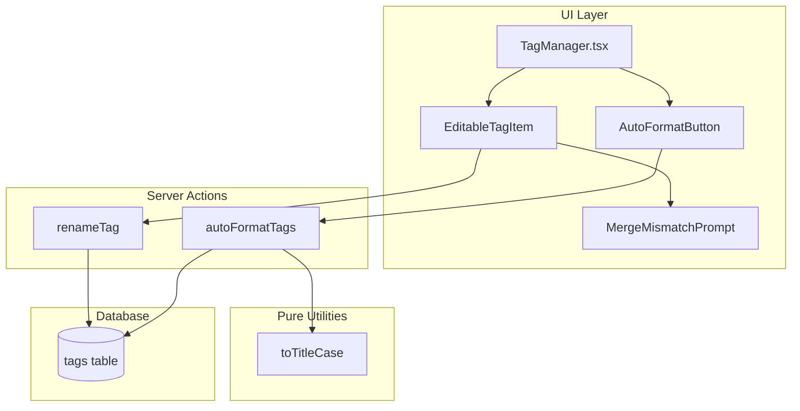

# Design Document

## Overview

V9.5 "Data Hygiene (The Cleanup Suite)" adds inline tag renaming and auto-formatting capabilities to the existing Tag Manager. The design prioritizes:

1. **Inline editing** - Edit tag names directly in the list without modals
2. **Collision safety** - Detect duplicates before saving and offer merge as resolution
3. **Bulk formatting** - Auto-format all tags to Title Case with collision protection
4. **Pure utilities** - Testable formatting functions separate from UI/server logic

## Architecture



## Components and Interfaces

### EditableTagItem Component

Location: Integrated into `src/components/tags/TagManager.tsx`

```typescript
interface EditableTagItemProps {
  tag: Tag
  isSelected: boolean
  isUpdating: boolean
  onToggleSelect: () => void
  onCategoryChange: (category: TagCategory) => void
  onRename: (newName: string) => Promise<RenameTagResult>
  onMergeRequest: (existingTagId: string) => void
}

// Internal state
interface EditState {
  isEditing: boolean
  editValue: string
  error: string | null
}
```

Behavior:
- Default: Display tag name with pencil icon
- Click pencil: Enter edit mode (input field)
- Enter/blur: Save changes via `onRename`
- Escape: Cancel and restore original
- Conflict response: Call `onMergeRequest` with existing tag ID

### AutoFormatButton Component

Location: `src/components/tags/AutoFormatButton.tsx`

```typescript
interface AutoFormatButtonProps {
  onComplete: (result: AutoFormatResult) => void
}

interface AutoFormatResult {
  updated: number
  skipped: Array<{ tagName: string; reason: string }>
}
```

Behavior:
- Click: Call `autoFormatTags` server action
- Show loading state during operation
- Display toast with summary on completion

### Server Action: renameTag

Location: `src/actions/admin-tag-actions.ts`

```typescript
type RenameTagResult =
  | { ok: true; tag: Tag }
  | { ok: false; error: string }
  | { ok: false; conflict: true; existingTagId: string; existingTagName: string }

async function renameTag(
  tagId: string,
  newName: string
): Promise<RenameTagResult>
```

Logic:
1. Validate `newName` is non-empty after trimming
2. Check if another tag with same name exists (case-insensitive)
3. If conflict: return `{ ok: false, conflict: true, existingTagId, existingTagName }`
4. If no conflict: update tag name, revalidate path, return success

### Server Action: autoFormatTags

Location: `src/actions/admin-tag-actions.ts`

```typescript
interface AutoFormatTagsResult {
  ok: true
  updated: number
  skipped: Array<{ tagId: string; tagName: string; reason: string }>
}

async function autoFormatTags(): Promise<AutoFormatTagsResult | { ok: false; error: string }>
```

Logic:
1. Fetch all tags for authenticated user
2. For each tag:
   - Compute `formatted = toTitleCase(tag.name)`
   - If `formatted === tag.name`: skip (already formatted)
   - If another tag has `name === formatted`: add to skipped with collision reason
   - Otherwise: update tag name to `formatted`
3. Return counts and skipped list

### Pure Utility: toTitleCase

Location: `src/lib/string-utils.ts`

```typescript
function toTitleCase(input: string): string
```

Logic:
1. Trim leading/trailing whitespace
2. Collapse multiple spaces to single space
3. Capitalize first letter of each word, lowercase rest
4. Return result (empty string if input was whitespace-only)

## Data Models

No new database tables required. Uses existing `tags` table:

```sql
-- Existing schema
CREATE TABLE tags (
  id UUID PRIMARY KEY DEFAULT gen_random_uuid(),
  user_id UUID REFERENCES auth.users(id) NOT NULL,
  name TEXT NOT NULL,
  color TEXT NOT NULL,
  category tag_category DEFAULT 'concept',
  created_at TIMESTAMPTZ DEFAULT now()
);

-- Existing unique constraint (case-sensitive)
CREATE UNIQUE INDEX tags_user_name_idx ON tags(user_id, name);
```

Note: Duplicate detection should be case-insensitive even though the unique constraint is case-sensitive. This prevents confusing situations like "Pelvic" and "pelvic" both existing.

## Correctness Properties

*A property is a characteristic or behavior that should hold true across all valid executions of a system-essentially, a formal statement about what the system should do. Properties serve as the bridge between human-readable specifications and machine-verifiable correctness guarantees.*

### Property 1: Title Case Formatting Correctness

*For any* non-empty string input, `toTitleCase` SHALL return a string where:
- The first character of each word is uppercase
- All other characters in each word are lowercase
- No leading or trailing whitespace exists
- No consecutive spaces exist

**Validates: Requirements 5.1, 5.2, 5.3**

### Property 2: Whitespace Input Rejection

*For any* string composed entirely of whitespace (including empty string), both `toTitleCase` and rename validation SHALL treat it as invalid:
- `toTitleCase` returns empty string
- `renameTag` returns validation error

**Validates: Requirements 1.5, 2.3, 5.4**

### Property 3: Collision Detection Prevents Duplicates

*For any* set of tags where auto-formatting would create a name collision, the `autoFormatTags` function SHALL:
- Skip the colliding tag
- Include it in the skipped list with reason
- Not modify the original tag name

**Validates: Requirements 3.3, 4.2, 4.3**

### Property 4: Auto-Format Result Completeness

*For any* execution of `autoFormatTags`, the result SHALL satisfy:
- `updated + skipped.length + alreadyFormatted === totalTags`
- Every tag is either updated, skipped (with reason), or was already formatted

**Validates: Requirements 4.5**

### Property 5: Edit Mode State Transitions

*For any* EditableTagItem component:
- Clicking edit icon transitions to edit mode with current name as value
- Pressing Escape returns to display mode with original name unchanged
- Pressing Enter triggers save with current input value

**Validates: Requirements 1.1, 1.2, 1.3**

### Property 6: Rename Conflict Detection

*For any* rename operation where the new name (case-insensitive) matches an existing tag, the system SHALL return a conflict response containing the existing tag's ID.

**Validates: Requirements 1.4, 2.2**

## Error Handling

| Scenario | Handling |
|----------|----------|
| Empty tag name | Client-side validation prevents submission; server returns error if bypassed |
| Duplicate name on rename | Return conflict response with existing tag ID; UI prompts for merge |
| Collision on auto-format | Skip tag, add to skipped list, continue processing others |
| Network error | Show toast with error message, preserve current state |
| Unauthenticated user | Server actions return error; UI should not be accessible |

## Testing Strategy

### Property-Based Testing

Use **fast-check** for property-based tests:

1. **toTitleCase properties** - Generate random strings, verify formatting invariants
2. **Whitespace rejection** - Generate whitespace-only strings, verify rejection
3. **Collision detection** - Generate tag sets with potential collisions, verify skipping
4. **Edit state transitions** - Generate event sequences, verify state machine

Each property-based test MUST:
- Run minimum 100 iterations
- Tag with comment: `**Feature: v9.5-data-hygiene, Property {number}: {property_text}**`
- Reference the correctness property from this design document

### Unit Tests

- `toTitleCase` edge cases: empty string, single word, mixed case, numbers, special characters
- `renameTag` validation: empty name, whitespace name, valid name
- `autoFormatTags` scenarios: no changes needed, all updated, some collisions

### Integration Points

- Verify `revalidatePath` is called after successful rename
- Verify merge modal appears when conflict detected
- Verify toast displays correct summary after auto-format
