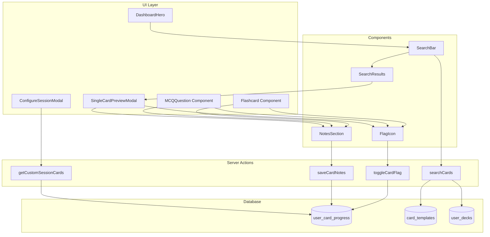

# Design Document: V10.6 - The Digital Notebook & Search

## Overview

V10.6 transforms Specialize from a flashcard app into a personalized medical companion by adding three key features:

1. **Card Flagging** - Bookmark cards for later review
2. **Personal Notes** - Add annotations to cards with auto-save
3. **Global Search** - Find content across subscribed decks
4. **Flagged Study Mode** - Study only flagged cards

These features work together to create a "digital notebook" experience where users can mark important content, add their own insights, and quickly find information.

## Architecture



## Components and Interfaces

### 1. FlagIcon Component

A reusable toggle button for flagging cards.

```typescript
interface FlagIconProps {
  cardTemplateId: string
  isFlagged: boolean
  onToggle?: (newState: boolean) => void
  size?: 'sm' | 'md' | 'lg'
}
```

**Behavior:**
- Displays filled bookmark when flagged, outline when not
- Optimistic UI update on click
- Reverts on error with toast notification
- Calls `toggleCardFlag` server action

### 2. NotesSection Component

A collapsible section for personal notes with auto-save.

```typescript
interface NotesSectionProps {
  cardTemplateId: string
  initialNotes: string | null
  onSave?: (notes: string) => void
}

type SaveStatus = 'idle' | 'saving' | 'saved' | 'error'
```

**Behavior:**
- Collapsible with chevron toggle
- Textarea with placeholder "Add your notes..."
- Auto-save after 1000ms of inactivity (useDebounce)
- Status indicator: "Saving..." → "Saved" → fades out
- Preserves content on error

### 3. SearchBar Component

A search input in the dashboard header.

```typescript
interface SearchBarProps {
  onResultClick?: (cardId: string) => void
}

interface SearchResult {
  id: string
  stem: string
  snippet: string
  deckTitle: string
}
```

**Behavior:**
- Debounced input (300ms)
- Dropdown results (max 10)
- Loading spinner during search
- Click result opens SingleCardPreviewModal
- Escape key closes dropdown

### 4. SingleCardPreviewModal Component

A modal for viewing a single card from search results.

```typescript
interface SingleCardPreviewModalProps {
  isOpen: boolean
  onClose: () => void
  cardTemplateId: string
}
```

**Behavior:**
- Fetches full card data on open
- Displays stem, options (for MCQ), explanation
- Includes FlagIcon and NotesSection
- Focus trap for accessibility

### 5. Server Actions

#### toggleCardFlag

```typescript
interface ToggleFlagResult {
  success: boolean
  isFlagged: boolean
  error?: string
}

async function toggleCardFlag(cardTemplateId: string): Promise<ToggleFlagResult>
```

**Logic:**
1. Get current user
2. Fetch or create user_card_progress record
3. Toggle is_flagged value
4. Return new state

#### saveCardNotes

```typescript
interface SaveNotesResult {
  success: boolean
  error?: string
}

async function saveCardNotes(cardTemplateId: string, notes: string): Promise<SaveNotesResult>
```

**Logic:**
1. Get current user
2. Upsert user_card_progress with notes
3. Return success/error

#### searchCards

```typescript
interface SearchCardsResult {
  success: boolean
  results: SearchResult[]
  error?: string
}

async function searchCards(query: string): Promise<SearchCardsResult>
```

**Logic:**
1. Get current user
2. Get user's subscribed deck_template_ids from user_decks
3. Search card_templates where deck_template_id in subscribed AND (stem ILIKE query OR explanation ILIKE query)
4. Limit to 10 results
5. Return with snippets

## Data Models

### Database Migration

Add columns to `user_card_progress`:

```sql
ALTER TABLE user_card_progress
ADD COLUMN is_flagged BOOLEAN NOT NULL DEFAULT FALSE,
ADD COLUMN notes TEXT DEFAULT NULL;
```

### Updated TypeScript Types

```typescript
// src/types/database.ts
export interface UserCardProgress {
  user_id: string
  card_template_id: string
  interval: number
  ease_factor: number
  repetitions: number
  next_review: string
  last_answered_at: string | null
  suspended: boolean
  correct_count: number
  total_attempts: number
  // V10.6: Digital Notebook
  is_flagged: boolean
  notes: string | null
}
```

## Correctness Properties

*A property is a characteristic or behavior that should hold true across all valid executions of a system-essentially, a formal statement about what the system should do. Properties serve as the bridge between human-readable specifications and machine-verifiable correctness guarantees.*

### Property 1: Flag Toggle Inverts State
*For any* card and any initial flag state (true or false), calling toggleCardFlag SHALL produce the opposite boolean value.
**Validates: Requirements 1.1**

### Property 2: Flag Icon Reflects State
*For any* card with a known is_flagged value, the FlagIcon component SHALL render a filled icon when true and an outline icon when false.
**Validates: Requirements 1.2, 1.3**

### Property 3: Notes Round-Trip Consistency
*For any* valid notes string, saving notes and then fetching the card SHALL return the same notes string.
**Validates: Requirements 2.6**

### Property 4: Search Results Subscription Filter
*For any* search query and result set, every returned card SHALL belong to a deck_template that the user has subscribed to via user_decks.
**Validates: Requirements 3.2**

### Property 5: Search Results Limit
*For any* search query, the number of results SHALL be at most 10.
**Validates: Requirements 3.3**

### Property 6: Search Results Contain Query
*For any* search query and non-empty result set, every returned card SHALL contain the query string (case-insensitive) in either the stem or explanation field.
**Validates: Requirements 3.1**

### Property 7: Flagged Filter Correctness
*For any* custom session with flagged_only=true, every returned card SHALL have is_flagged=true in user_card_progress.
**Validates: Requirements 5.2**

### Property 8: Combined Filters AND Logic
*For any* custom session with multiple filters (tags, decks, flagged), every returned card SHALL satisfy ALL active filter conditions.
**Validates: Requirements 5.4**

### Property 9: Progress Record Defaults
*For any* newly created user_card_progress record, is_flagged SHALL be false and notes SHALL be null.
**Validates: Requirements 6.1, 6.2**

### Property 10: Upsert Creates Record
*For any* card without existing progress, calling toggleCardFlag or saveCardNotes SHALL create a new user_card_progress record with the specified value.
**Validates: Requirements 6.3, 6.4**

## Error Handling

### Flag Toggle Errors
- Network failure: Revert optimistic update, show toast "Failed to update flag"
- Auth error: Redirect to login
- Database error: Log error, show generic toast

### Notes Save Errors
- Network failure: Keep content in textarea, show "Failed to save" status
- Auth error: Redirect to login
- Content too long: Show validation error (if we add a limit)

### Search Errors
- Network failure: Show "Search unavailable" in dropdown
- Empty results: Show "No results found"
- Auth error: Redirect to login

## Testing Strategy

### Unit Tests
- FlagIcon renders correct icon based on state
- NotesSection displays initial notes
- SearchBar debounces input correctly
- Search result snippet generation

### Property-Based Tests (fast-check)

The following properties will be tested using fast-check:

1. **Flag toggle inverts state** - Generate random boolean, verify toggle produces opposite
2. **Notes round-trip** - Generate random strings, verify save/fetch consistency
3. **Search results subscription filter** - Generate mock data, verify all results are from subscribed decks
4. **Search results limit** - Generate queries, verify results.length <= 10
5. **Flagged filter correctness** - Generate cards with mixed flag states, verify filter
6. **Combined filters AND logic** - Generate multiple filter combinations, verify all conditions met
7. **Progress record defaults** - Generate new records, verify defaults

Each property test will run 100+ iterations with random inputs.

### Integration Tests
- Full flag toggle flow with database
- Notes auto-save with debounce timing
- Search with real database queries
- Custom session with flagged filter
