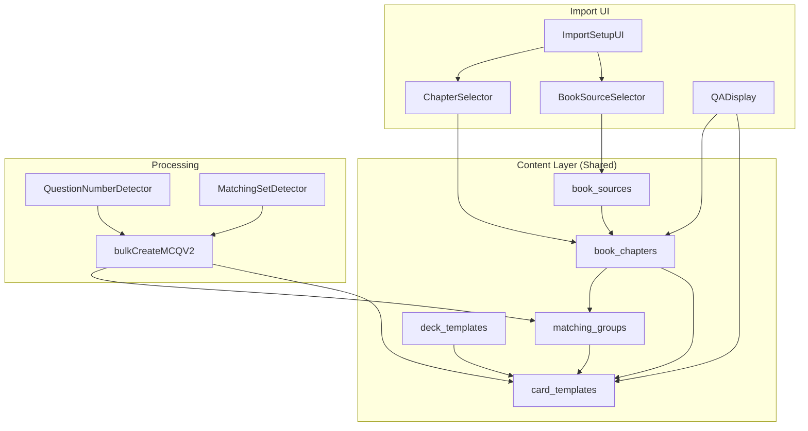
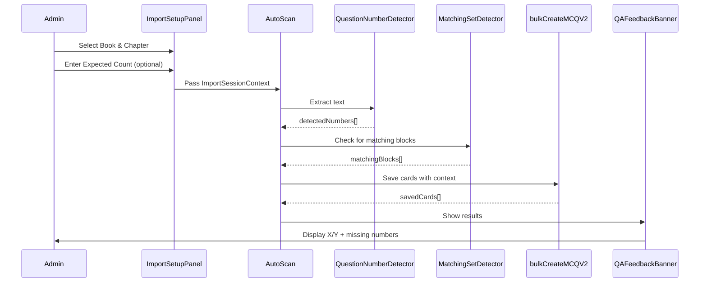

# Design Document: V11 - Structured Content Engine

## Overview

V11 introduces a relational content model to replace fragile tag-based organization. The key additions are:

1. **Book Sources** - Structured metadata for textbooks and question banks
2. **Chapters** - Hierarchical organization within books
3. **Matching Groups** - Shared options for matching-style questions
4. **QA Workflow** - Expected vs. actual question count tracking with missing number detection

All changes are additive and backwards-compatible. Existing tag-based workflows continue to function.

## Architecture



## Components and Interfaces

### 1. Database Schema Extensions

#### book_sources Table

```sql
CREATE TABLE book_sources (
  id UUID PRIMARY KEY DEFAULT gen_random_uuid(),
  author_id UUID NOT NULL REFERENCES auth.users(id) ON DELETE CASCADE,
  title TEXT NOT NULL,
  edition TEXT,
  specialty TEXT,
  created_at TIMESTAMPTZ DEFAULT NOW()
);

CREATE INDEX idx_book_sources_author_id ON book_sources(author_id);

ALTER TABLE book_sources ENABLE ROW LEVEL SECURITY;

CREATE POLICY "Authors can manage own book_sources" ON book_sources
  FOR ALL USING (auth.uid() = author_id);
```

#### book_chapters Table

```sql
CREATE TABLE book_chapters (
  id UUID PRIMARY KEY DEFAULT gen_random_uuid(),
  book_source_id UUID NOT NULL REFERENCES book_sources(id) ON DELETE CASCADE,
  chapter_number INTEGER NOT NULL,
  title TEXT NOT NULL,
  expected_question_count INTEGER,
  created_at TIMESTAMPTZ DEFAULT NOW(),
  UNIQUE(book_source_id, chapter_number)
);

CREATE INDEX idx_book_chapters_book_source_id ON book_chapters(book_source_id);

ALTER TABLE book_chapters ENABLE ROW LEVEL SECURITY;

CREATE POLICY "Authors can manage chapters in own books" ON book_chapters
  FOR ALL USING (
    EXISTS (
      SELECT 1 FROM book_sources 
      WHERE book_sources.id = book_chapters.book_source_id 
      AND book_sources.author_id = auth.uid()
    )
  );
```

#### matching_groups Table

```sql
CREATE TABLE matching_groups (
  id UUID PRIMARY KEY DEFAULT gen_random_uuid(),
  chapter_id UUID REFERENCES book_chapters(id) ON DELETE SET NULL,
  common_options JSONB NOT NULL,
  instruction_text TEXT,
  created_at TIMESTAMPTZ DEFAULT NOW()
);

CREATE INDEX idx_matching_groups_chapter_id ON matching_groups(chapter_id);

ALTER TABLE matching_groups ENABLE ROW LEVEL SECURITY;

CREATE POLICY "Authors can manage matching_groups via chapter" ON matching_groups
  FOR ALL USING (
    chapter_id IS NULL OR EXISTS (
      SELECT 1 FROM book_chapters
      JOIN book_sources ON book_sources.id = book_chapters.book_source_id
      WHERE book_chapters.id = matching_groups.chapter_id
      AND book_sources.author_id = auth.uid()
    )
  );
```

#### card_templates Extensions

```sql
ALTER TABLE card_templates
ADD COLUMN book_source_id UUID REFERENCES book_sources(id) ON DELETE SET NULL,
ADD COLUMN chapter_id UUID REFERENCES book_chapters(id) ON DELETE SET NULL,
ADD COLUMN question_number INTEGER,
ADD COLUMN matching_group_id UUID REFERENCES matching_groups(id) ON DELETE SET NULL;

CREATE INDEX idx_card_templates_chapter_id ON card_templates(chapter_id);
CREATE INDEX idx_card_templates_book_source_id ON card_templates(book_source_id);
CREATE INDEX idx_card_templates_matching_group_id ON card_templates(matching_group_id);
```

### 2. TypeScript Types

```typescript
// src/types/database.ts

export interface BookSource {
  id: string
  author_id: string
  title: string
  edition: string | null
  specialty: string | null
  created_at: string
}

export interface BookChapter {
  id: string
  book_source_id: string
  chapter_number: number
  title: string
  expected_question_count: number | null
  created_at: string
}

export interface MatchingGroup {
  id: string
  chapter_id: string | null
  common_options: string[]  // JSONB array of option strings
  instruction_text: string | null
  created_at: string
}

// Extended CardTemplate
export interface CardTemplate {
  // ... existing fields ...
  book_source_id: string | null
  chapter_id: string | null
  question_number: number | null
  matching_group_id: string | null
}

// Import session context
export interface ImportSessionContext {
  bookSourceId: string | null
  chapterId: string | null
  expectedQuestionCount: number | null
  detectedQuestionNumbers: number[]
}
```

### 3. BookSourceSelector Component

```typescript
interface BookSourceSelectorProps {
  selectedId: string | null
  onChange: (id: string | null) => void
  onCreateNew?: () => void
}
```

**Behavior:**
- Fetches book_sources for current author
- Dropdown with search/filter
- "Create New" option triggers inline dialog
- Clears chapter selection when book changes

### 4. ChapterSelector Component

```typescript
interface ChapterSelectorProps {
  bookSourceId: string | null
  selectedId: string | null
  onChange: (id: string | null) => void
  onCreateNew?: () => void
}
```

**Behavior:**
- Disabled when no book selected
- Fetches chapters filtered by book_source_id
- Orders by chapter_number ascending
- "Create New" option for inline chapter creation

### 5. ImportSetupPanel Component

```typescript
interface ImportSetupPanelProps {
  onContextChange: (context: ImportSessionContext) => void
}
```

**Behavior:**
- Renders BookSourceSelector and ChapterSelector
- Optional "Expected Question Count" number input
- Passes context to parent for use in Auto-Scan

### 6. QAFeedbackBanner Component

```typescript
interface QAFeedbackBannerProps {
  generatedCount: number
  expectedCount: number | null
  missingNumbers: number[]
}
```

**Behavior:**
- Shows "Generated X / Expected Y" when expectedCount provided
- Warning banner (amber) when X < Y
- Success indicator (green) when X >= Y
- Expandable list of missing question numbers

### 7. QuestionNumberDetector Utility

```typescript
interface DetectionResult {
  detectedNumbers: number[]
  patterns: string[]  // Which patterns were found
}

function detectQuestionNumbers(text: string): DetectionResult
```

**Patterns to detect:**
- `1.`, `2.`, `3.` (period-terminated)
- `1)`, `2)`, `3)` (parenthesis-terminated)
- `Q1`, `Q2`, `Q3` (Q-prefixed)
- `Question 1`, `Question 2` (word-prefixed)

### 8. MatchingSetDetector Utility

```typescript
interface MatchingBlock {
  optionLabels: string[]      // ['A', 'B', 'C', 'D', 'E']
  optionTexts: string[]       // The actual option content
  questionNumbers: number[]   // Questions that reference these options
  rawText: string            // Original text block
}

function detectMatchingBlocks(text: string): MatchingBlock[]
```

**Detection logic:**
- Find contiguous labeled options (A., B., C., etc.)
- Find subsequent numbered questions
- Group when questions clearly reference the option block

### 9. Extended bulkCreateMCQV2 Action

```typescript
interface BulkCreateV2Input {
  deckTemplateId: string
  sessionTags?: string[]
  cards: MCQBatchDraft[]
  // V11: Optional structured source context
  bookSourceId?: string
  chapterId?: string
  matchingGroupId?: string
}
```

**Extended Logic:**
1. Accept optional book/chapter/matching parameters
2. If provided, populate new FK columns on card_templates
3. If matchingGroupId provided, link cards to group
4. Backwards compatible: null when not provided

## Data Models

### Import Session Flow



## Correctness Properties

*A property is a characteristic or behavior that should hold true across all valid executions of a system-essentially, a formal statement about what the system should do. Properties serve as the bridge between human-readable specifications and machine-verifiable correctness guarantees.*

### Property 1: Book Source Title Validation
*For any* string input to book source creation, if the string is empty or contains only whitespace, the System SHALL reject the creation with a validation error.
**Validates: Requirements 1.2**

### Property 2: Chapter Number Validation
*For any* chapter creation input, if chapter_number is zero or negative OR title is empty/whitespace, the System SHALL reject the creation with a validation error.
**Validates: Requirements 2.2**

### Property 3: Chapter Ordering
*For any* list of chapters returned for a book source, the chapters SHALL be ordered by chapter_number in ascending order.
**Validates: Requirements 2.3**

### Property 4: Card-Chapter Linking with Context
*For any* bulk import operation where bookSourceId and chapterId are provided, all saved card_templates SHALL have those values populated in their respective columns.
**Validates: Requirements 3.2**

### Property 5: Card-Chapter Linking without Context
*For any* bulk import operation where bookSourceId and chapterId are NOT provided, all saved card_templates SHALL have NULL values in book_source_id and chapter_id columns.
**Validates: Requirements 3.3**

### Property 6: Chapter Card Query Correctness
*For any* chapter_id and set of card_templates, querying cards by that chapter_id SHALL return exactly the cards where chapter_id matches, and no others.
**Validates: Requirements 3.4**

### Property 7: Matching Group Card Denormalization
*For any* card_template that belongs to a matching_group, the card SHALL have its own options field populated (not null or empty), independent of the group's common_options.
**Validates: Requirements 4.3**

### Property 8: Chapter Selector Filtering
*For any* selected book_source_id, the chapter selector SHALL display only chapters where book_source_id matches the selected book.
**Validates: Requirements 5.2**

### Property 9: QA Warning Display
*For any* import result where generatedCount < expectedCount, the System SHALL display a warning indicator.
**Validates: Requirements 6.2**

### Property 10: QA Success Display
*For any* import result where generatedCount >= expectedCount, the System SHALL display a success indicator.
**Validates: Requirements 6.3**

### Property 11: Question Number Pattern Detection
*For any* text containing question numbering patterns (1., 2., 1), 2), Q1, Q2, etc.), the detectQuestionNumbers function SHALL return all detected numbers in the result set.
**Validates: Requirements 7.1**

### Property 12: Missing Question Number Calculation
*For any* set of detected question numbers and set of saved question_number values, the missing numbers SHALL equal the set difference (detected - saved).
**Validates: Requirements 7.3, 7.4**

### Property 13: Matching Block Detection
*For any* text containing a contiguous block of labeled options (A., B., C.) followed by numbered questions, the detectMatchingBlocks function SHALL identify and return the block.
**Validates: Requirements 8.1**

### Property 14: Matching Block Card Options
*For any* card generated from a matching block, the card's options array SHALL contain all options from the matching block's common_options.
**Validates: Requirements 8.3**

### Property 15: Matching Group Linking
*For any* set of cards saved from a matching block, all cards SHALL reference the same matching_group_id, and that matching_group record SHALL exist.
**Validates: Requirements 8.4**

### Property 16: Backwards Compatibility
*For any* call to bulkCreateMCQV2 without bookSourceId/chapterId parameters, the function SHALL execute successfully and save cards with null values for the new columns.
**Validates: Requirements 9.2, 9.5**

## Error Handling

### Book/Chapter Creation Errors
- Empty title: Show inline validation error "Title is required"
- Invalid chapter number: Show "Chapter number must be positive"
- Duplicate chapter: Show "Chapter X already exists in this book"
- Database error: Show toast "Failed to create [book/chapter]"

### Import Context Errors
- Book not found: Show "Selected book no longer exists"
- Chapter not found: Show "Selected chapter no longer exists"
- Context mismatch: Log warning, proceed with null context

### QA Detection Errors
- Regex failure: Log error, return empty detection result
- Large text timeout: Limit detection to first N characters

## Testing Strategy

### Unit Tests
- BookSourceSelector renders options correctly
- ChapterSelector filters by book
- QAFeedbackBanner shows correct state (warning/success)
- Question number regex patterns

### Property-Based Tests (fast-check)

The following properties will be tested using fast-check:

1. **Title validation** - Generate random strings including empty/whitespace, verify rejection
2. **Chapter number validation** - Generate integers including 0/negative, verify rejection
3. **Chapter ordering** - Generate random chapters, verify sorted output
4. **Card-chapter linking** - Generate import contexts, verify FK population
5. **Chapter query correctness** - Generate cards with various chapter_ids, verify filter
6. **Matching group denormalization** - Generate grouped cards, verify options populated
7. **Question number detection** - Generate text with patterns, verify detection
8. **Missing number calculation** - Generate detected/saved sets, verify difference
9. **Matching block detection** - Generate matching block text, verify detection
10. **Backwards compatibility** - Call without new params, verify success

Each property test will run 100+ iterations with random inputs.

### Integration Tests
- Full import flow with book/chapter selection
- QA feedback with real card counts
- Matching group creation and linking
